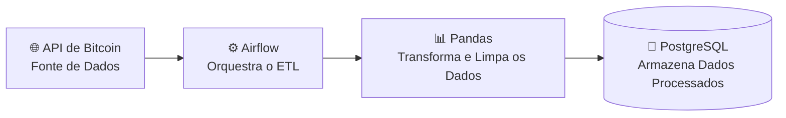

# 💰 ETL Bitcoin - Airflow, PostgreSQL & Docker

## 💡 Ideia do Projeto

O projeto consiste em um **pipeline ETL (Extract, Transform, Load)** para coletar dados da **API de Bitcoin**, processá-los com **Pandas** e armazená-los em um **banco de dados PostgreSQL**.

Toda a orquestração é feita com o **Apache Airflow**, garantindo que as DAGs sejam executadas **a cada 15 minutos** para manter os dados sempre atualizados.

O ambiente é **totalmente containerizado com Docker**, permitindo fácil reprodutibilidade e implantação em qualquer ambiente.

---

## 🧭 Fluxo de Dados



O Airflow agenda as execuções de ETL, que fazem:
1. **Extração:** Consome os dados da API de Bitcoin.
2. **Transformação:** Limpa, valida e estrutura os dados com Pandas.
3. **Carga:** Insere ou atualiza os registros no banco PostgreSQL.

---

## 🛠️ Tecnologias Utilizadas


---

## 🗂️ Estrutura do Projeto

```bash
├── dags/                                 # Contém os pipelines (DAGs) do Airflow
│   └── etl/
│       ├── dags/                         # Arquivos de DAGs principais
│       └── src/                          # Código-fonte do ETL
│           ├── data/                     # Diretório principal de dados e lógica de ETL
│           │   ├── bitcoin_quotes/      # Extração de cotações de Bitcoin
│           │   ├── databases_connection/ # Gerenciamento de conexões com bancos SQL
│           │   ├── bitcoin_data/          # Transformações e manipulação de dados
│           │   ├── utils/                # Funções auxiliares reutilizáveis
│           │   └── worker/               # Workers específicos por moeda ou tipo de dado
├── logs/                                 # Logs do Airflow
├── plugins/                              # Plugins personalizados (operadores, sensores, hooks, etc.)
```

---

## ⚙️ Como Executar o Projeto

### 🧰 Pré-requisitos

Certifique-se de ter instalado:

- [Docker](https://docs.docker.com/get-docker/)  
- [Docker Compose](https://docs.docker.com/compose/)

---

### 1️⃣ Clone o repositório
```bash
git clone https://github.com/joaobarreto27/etl_bitcoin_jd
cd etl-bitcoin-airflow
```

---

### 2️⃣ Configure as variáveis de ambiente

Crie um arquivo `.env` na raiz do projeto com o conteúdo:

```env
# Banco de Dados
POSTGRES_DB=bitcoin_db
POSTGRES_USER=admin
POSTGRES_PASSWORD=admin
POSTGRES_HOST=postgres
POSTGRES_PORT=5432
```

---

### 3️⃣ Inicie o ambiente Docker

```bash
# 1️⃣ Buildar tudo (sem cache):
docker-compose build --no-cache

# 2️⃣ Subit somente o cotainer init:
docker-compose up airflow-init

# 3️⃣ Subir todo o restante do ambiente ambiente:
docker-compose up -d
```

Os comandos acima irá subir:
- O **Airflow Scheduler**
- O **Airflow Webserver**
- O **PostgreSQL**
- O **Airflow Worker**

A interface do Airflow estará disponível em:
👉 [http://localhost:8080](http://localhost:8080)

---

## 💻 Executando Localmente (sem Docker) com Poetry
```bash
# 1️⃣ Instale o Poetry se ainda não tiver
curl -sSL https://install.python-poetry.org | python3 -

# 2️⃣ Instale dependências do projeto via Poetry
poetry install

# 3️⃣ Ative o ambiente do Poetry
poetry shell

# 4️⃣ Execute um pipeline de exemplo
cd dags/etl/
python src/worker/quotes_btc/etl_quotes_btc_daily_event.py
```

## 🕓 Agendamento das DAGs

A DAG é configurada para rodar **a cada 15 minutos**, conforme exemplo abaixo:

```python
from datetime import timedelta

schedule_interval = "*/15 * * * *"  # Executa a cada 15 minutos
```

---

## 🧩 Pipeline ETL

**1. Extract:**  
Busca os dados da API de Bitcoin.  
Exemplo de retorno:
```json
{
  "data": {
    "base": "BTC",
    "currency": "USD",
    "amount": "67231.54"
  }
}
```

**2. Transform:**  
Converte o JSON em DataFrame Pandas, valida valores nulos, e formata timestamps.

**3. Load:**  
Insere no PostgreSQL com controle de duplicidade e schema definido.

---

## 💾 Banco de Dados

O banco PostgreSQL é inicializado automaticamente via Docker Compose.  
Você pode acessar o banco usando:

```bash
docker exec -it postgres psql -U admin -d bitcoin_db
```

### Estrutura da Tabela

| Coluna       | Tipo       | Descrição                    |
|---------------|------------|-------------------------------|
| id            | SERIAL PK  | Identificador único           |
| base_currency | TEXT       | Moeda base (ex: BTC)          |
| target_currency | TEXT     | Moeda de conversão (ex: USD)  |
| amount        | NUMERIC    | Valor da cotação              |
| timestamp     | TIMESTAMP  | Data/hora da coleta           |

---

## 🔍 Logs e Monitoramento

Os logs das DAGs podem ser acessados diretamente na interface do **Airflow**, em:
`Admin → DAGs → bitcoin_dag → Log`

---

## 💾 Banco de Dados

O projeto utiliza **PostgreSQL** em produção, mas também suporta **SQLite** para testes locais.

Exemplo de configuração no código:

```python
USE_SQLITE = True

connection = ConnectionDatabaseSpark(
    sgbd_name="sqlite" if USE_SQLITE else "postgresql",
    environment="prd" if USE_SQLITE else "prd",
    db_name="etl_bitcoin_jd",
)
```

---

## 🧠 Boas Práticas Adotadas

- Uso de **Pandas** para limpeza e transformação eficiente.  
- **Validação de dados** antes da carga no banco (schema + tipos).  
- **Atomicidade** nas transações com SQLAlchemy.  
- **Docker Compose** para reprodutibilidade total do ambiente.  
- **Versionamento de dependências** no `requirements.txt`.  
- **Isolamento modular**: cada etapa (Extract, Transform, Load) em seu próprio módulo.

---

## 🧑‍💻 Autor

👤 **João Vitor**  
💼 Engenheiro de Dados  
📧 [joaovitor@email.com](mailto:joao.vito1951@gmail.com)  
🐙 [GitHub](https://github.com/joaobarreto27)  
🔗 [LinkedIn](https://www.linkedin.com/in/jo%C3%A3o-vitor-barreto-495a6a222/)

---

## 📚 Referências

- [Apache Airflow Docs](https://airflow.apache.org/docs/)
- [Pandas Documentation](https://pandas.pydata.org/docs/)
- [Coinbase API Reference](https://developers.coinbase.com/api/v2)
- [PostgreSQL Documentation](https://www.postgresql.org/docs/)
- [Docker Docs](https://docs.docker.com/)

---
